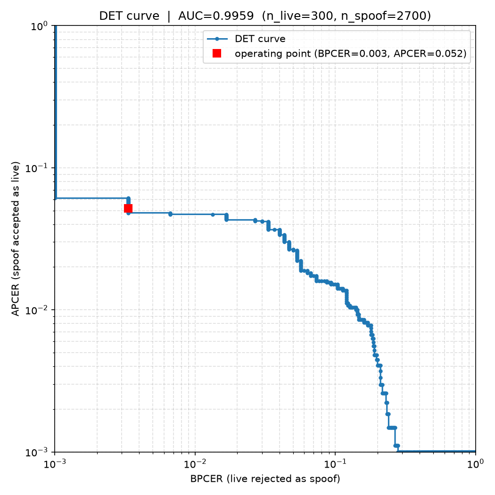
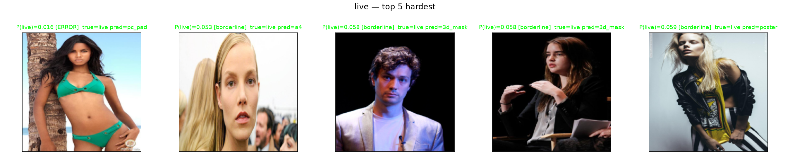
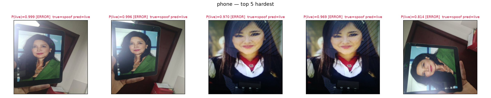

# PAD on CelebA-Spoof — Concise Report

## 1. Dataset and subset used

**Dataset.** CelebA-Spoof is a large-scale face **Presentation Attack Detection
(PAD)** dataset of ~500k images across **10 classes**: live (bona-fide) plus 9
attack types — photo, poster, A4-print, face mask, upper-body mask, region mask,
PC-screen replay, phone replay, and 3D mask. Each sample carries a face bounding
box, plus environment and illumination labels. We read it from the public Google
Drive mirror (`1OW_1bawO79pRqdVEVmBzp8HSxdSwln_Z`, 74 × 1 GB split zips) and/or
the Kaggle mirror (`attentionlayer241/celeba-spoof-for-face-antispoofing`).

**Data acquisition note.** The original CelebA-Spoof zip archives could not be
downloaded directly on the GCP training VMs: Google Drive IP-banned the
cloud-hosted IPs during the initial bulk download (ran into the per-request quota error
“Too many users have viewed or downloaded this file recently”), so the 74 split
zips had to be downloaded to a local (residential) machine instead. Some of the
downloaded zip archives were broken/corrupt and parts of the metadata were
missing
The ground-truth labels/annotations were therefore acquired from a
third-party Kaggle repository (`data/labels/label.csv`)

**Subset.** The repo trains on a **stratified, identity-exclusive subset**,
*sampled without needing the full archive on disk*:

- **20,000** images sampled total (budget `data.subset.budget_total = 20000`).
- **10 classes, equal per-class counts** per split, capped by the scarcest class
  (typically 3D-mask).
- **70 / 15 / 15** train / val / test split (14,000 / 3,000 / 3,000) that is
  **subject-disjoint** (no identity leakage between splits).
- Within each attack type, **environment and illumination** are balanced
  proportionally as secondary stratification.
- Per-class counts (train / val / test, per spoof type — all 10 identical):
  - train **1,400** per class (14,000 total)
  - val & test **300** per class (3,000 each)
  - Verified by `data/subsets/balance_report.md` → **RESULT: PASS** (equal
    per-class counts, zero subject overlap, all spoof types present, no dups)
- Images on disk: 20,000, self-contained under `data/dataset/{train,val,test}/{spoof_name}/`
  (built by `pad export`); labels/bboxes from the official `label.csv` joined in
  `pad prepare`.

**Ready-made archives.** Both build directories are published and can be restored by
downloading and unpacking:
- `data/`: `https://storage.googleapis.com/tfh_data_ck/data_remote.zip`
- `results/`: `https://storage.googleapis.com/tfh_data_ck/results.tar.gz`

## 2. Method / hypothesis

**Hypothesis.** 2D attacks (printed/screen) are separable from live faces by
*texture + geometry*: they are flat (no depth relief) and carry high-frequency
print-grain / moiré / border artifacts, while live faces (and physical 3D masks)
have a real anatomical depth relief. A model that combines **(a)** a strong
frozen-ish DINOv2 backbone, **(b)** a depth-regression head supervised to expect
flat planes on flat 2D attacks and real pseudo-depth on live/3D classes, and
**(c)** a hand-tuned high-frequency texture branch, should reach a low
APCER/BPCER/ACER with limited data.

So the basic idea is to combine multiple complementary classification heads (RGB, high frequency domain, depth) using a SOTA embedding (Dinov2) which has been pretrained and proven to deliver good results for many vision tasks.
As the spoof label gives us an additional supervisory signal we attach and additional head for it using cross entropy loss.
As the depth approach was regarded as hard to implement/train it was neglected throughoout the experiments and remains for future work. 

**Model (baseline — depth OFF).** 
* Baseline network: shared DINOv2-Base backbone,
extended face crop (bbox ×1.3) at 224 px + luminance high-frequency map,
* heads:
  * binary live/spoof (BCE), 
  * 10-way spoof-type (CE)
  * HF auxiliary (BCE)
  * depth (off by default)
* Loss = `BCE + γ_hf·BCE(HF) + λ_t·CE(spoof_type)`. 

**Depth head — optional add-on (evaluable experiment).** Adding
`model.use_depth_head: true` attaches a `DepthHead` on the DINOv2 patch tokens
→ 112×112 depth map, supervised with Smooth-L1 on the face-masked region: live +
physical-3D mask classes regress Depth-Anything pseudo-depth, the six flat 2D
classes regress a flat zero plane, with per-image confidence weighting and a
trivial-solution guard. See §2.1 for the evaluation protocol.

**Training procedure**
The model was trained for 40 epochs with a `learning rate` of 1.0e-4 and a `weight_decay` of 1.0e-4 using an AdamW optimizer.
To speed up training early stopping with a patience if 10 epochs was used.

**Results and conclusion.** Best (latest) artifact: `results/20260902_140219_bench/best.pt` (download from GCS bucket)
(24 epochs, early-stopped, best val epoch 14; DINOv2-Base + HF branch + spoof-type
head, **depth off**). Test-set metrics
(`results/20260902_140219_bench/test_metrics.json`, n=3,000 — 300 live + 2,700 spoof),
threshold from val at BPCER≈1%:

| Metric | Value |
|---|---|
| Threshold (@BPCER≈1%) | 0.0320 |
| APCER | 5.19% |
| BPCER | 0.33% |
| ACER | **2.76%** |
| AUC | 0.9959 |
| HTER | 2.76% |
| TPR@FPR0.01 | 86.0% |
| ACER 95% CI | [2.26%, 3.28%] |

**Error rate by spoof type (test, n=300 per class):**

| spoof_type | n | error rate | mean P(live) |
|---|---|---|---|
| live | 300 | 0.33% | 0.946 |
| photo | 300 | 0.33% | 0.001 |
| poster | 300 | 0.00% | 0.000 |
| a4 | 300 | 0.33% | 0.000 |
| face_mask | 300 | 0.67% | 0.001 |
| upper_body_mask | 300 | 0.00% | 0.000 |
| region_mask | 300 | 0.00% | 0.000 |
| pc_pad | 300 | 5.67% | 0.017 |
| phone | 300 | 9.33% | 0.045 |
| 3d_mask | 300 | 30.33% | 0.174 |

The model is near-perfect on printed/replay presentations but struggles most on pc/phone replays and 3D masks -- the classes whose cues most closely mimic a live face.

Training: 24 epochs
(best val ACER at epoch 14, early-stopped at 24); val ACER noisy across epochs
(~3–18% range), best val ≈3.5% at epoch 14. Conclusion: the BCE+HF+spoof-type
baseline (depth off) reaches test ACER ≈2.8% / AUC ≈0.996; the error is
concentrated in pc_pad, phone and especially 3d_mask (30.3%).

### 2.1 Depth-head add-on evaluation protocol (not used in experiments)

Purpose: quantify whether the **depth head adds anything** over the simple
baseline on the *same* subset, split, and seed.

**Enable it:**
```bash
# configs/base.yaml: model.use_depth_head: true   (default is false)
uv run python -m pad depth_targets --config configs/base.yaml --splits "train val test"   # pseudo-depth for live+3D classes
uv run python -m pad train --config configs/base.yaml --run-name with_depth
```
(loss term becomes `+ λ_d·D(depth)`. `pad depth_targets` is only needed when
depth is enabled.)

**Runs to compare** (same data, splits, seed):

| run | config | collected |
|---|---|---|
| baseline | `use_depth_head: false` | ACER/APCER/BPCER/AUC, per-spoof-type, confusion, hard-samples |
| +depth | `use_depth_head: true` | same metrics + depth diagnostics |

**Depth diagnostics to report** (per run, `results/<run>/per_type.csv` +
`train.log`): per-class face-rect depth variance (structure expected on
live/3D, ~flat on 2D), trained MSE/var on estimated vs flat groups, and the
depth-guard `var_estimated / var_flat` ratio.

**Hypotheses & known risks:**
- Expected gain on 2D attacks (photo/poster/A4/pc/phone/region) via flat-vs-relief
  depth; uncertain whether the sparse 20k subset + pretrained DINOv2 already
  captures that signal from texture alone.
- **3D-mask classes are NOT depth-discriminated** — they get real pseudo-depth
  (treated like live for the depth head); their detection rests on HF +
  spoof-type semantics. So depth should NOT be expected to move 3D-mask ACER.
- Ablations if the add-on looks promising: MSE vs Smooth-L1, λ_d sweep
  {0.1, 1, 10}, per-type vs all-estimated vs all-flat depth targets, `depth_res`.

### 2.2 Threshold selection & DET curve

**Threshold choice (P(live)).** The operating threshold is chosen on the
**validation split** so that **BPCER ≈ 1%** (`eval.bpcer_target: 0.01`,
`eval.threshold_source: dev`). `find_threshold()` sweeps every unique val
`P(live)` score and picks the one whose val-BPCER is closest to the 1% target
(`src/pad/utils.py`); the resulting threshold is then frozen and applied to the
test split. For the latest run the chosen threshold is **t = 0.0320**
(`results/20260902_140219_bench/test_metrics.json`).

**Why BPCER ≈ 1%?** The two PAD error rates are not equally serious.
**APCER** (spoof accepted as live) is the security-relevant failure (an
attacker gets through), **BPCER** (genuine live user rejected) is a “false
rejection” that mainly costs a retry. In real deployments (access control,
payments, onboarding) letting a presentation attack through is far worse than
occasionally flagging a real user, so evaluation anchors the threshold at a
**low BPCER** (here 1%) and reports the APCER that results. This is the
ISO/IEC 30107-3-style convention this project uses (see README/architecture: “Eval | APCER/BPCER/ACER @ BPCER≈1%”).
Another possibility for determining the threshold would be using the equal error rate.

Fixing the operating point this way also makes runs comparable and honest:
- It pins a **usability guarantee** — the same ≈1% false-rejection rate for
  every run — so APCER/ACER is compared at a realistic, controlled
  deployment point rather than at whichever threshold flatters each run.
- It prevents gaming the metric: one cannot slide the threshold to inflate a
  run’s ACER, because the operating point is fixed by the rule.
- The threshold is chosen on the **validation** split and frozen before the
  test split (`threshold_source: dev`). Choosing it on test would overfit the
  threshold to the test set and report an optimistically easy operating point.

Trade-off: anchoring BPCER at 1% rejects few genuine users but admits more
attacks when live/spoof score distributions overlap: this latest run’s low
threshold (0.032, fixed for BPCER≈1%) admits more spoofs, so APCER is 5.19%
while AUC remains high (0.9959). If a deployment prioritises strict security
over user friction, a higher `bpcer_target` (e.g. 5–10%) trades more false
rejections for a lower APCER.

**DET curve.** For a sweep of every observed `P(live)` score, the two
presentation-attack error rates (ISO 30107-3) are plotted against each other on
log axes: **BPCER** (x, live rejected as spoof, ``live`` → ``spoof``) vs
**APCER** (y, spoof accepted as live, ``spoof`` → ``live``), with the operating
point marked (``src/pad/evaluate.py::make_det_curve``):



- Raw curve: **`results/20260902_140219_bench/det_curve.csv`** (columns `threshold, BPCER, APCER`).
- At the operating point (BPCER ≈1% on val) the test-set operating point is
  **BPCER = 0.33%, APCER = 5.19%** (the red square on the DET plot where ACER = 2.76%, AUC = 0.9959). Because the log axes
  clip at the operating region, errors ≤0.1% for most attack classes sit at the
  lower plot edges, which is why the curve collapses toward the origin for the
  strong classes.

### 2.3 Failure-mode analysis

Below some failure modes for the two error scenarios are visualized. As we set the threshold in such a way that almost no live samples are classified as spoof, there is only one misclassified image.

Unfortunately for the phone spoof case the failures seem hard to explain. The borders of the screen are clearly visible in 3 images and there are also fingers visible holding the screen. I guess extending the ROI to the whole image or have another classification head with the whole image as inout could make sense. The close up image where no borders are visible is a hard case that can only be distinguished from live samples in the HF spectrum or by adding the depth head (if at all).

- **Live** (hardest-to-accept live faces; only true error at P(live)=0.016):

  

- **Phone** (the worst attack class; misclassified replays score P(live)=0.97-0.999):

  


## 3. Exact commands (prepare → train → evaluate)

> `uv` manages the env (`pyproject.toml`). All CLIs use Google Fire: flags are
> keyword args. Commands assume a CUDA host for the real run.

### 3.1 Prepare the subset (self-contained under `data/`)

```bash
# credentials (gitignored)
cp .env.example .env        # KAGGLE_USERNAME, KAGGLE_KEY

# (a) fetch + verify the official annotations (one time per machine)
bash scripts/fetch_annotations.sh

# (b) stratified, identity-exclusive subset CSVs from the on-disk mirror
uv run python -m pad prepare --data-root /path/to/CelebA_Spoof \
    --labels data/labels/label.csv --config configs/base.yaml

# (c) organize the images into data/dataset/{split}/{class}/ (copies)
uv run python -m pad export --subsets-dir data/subsets --out-dir data/dataset

# (d) pseudo-depth cache -- ONLY for the depth-head add-on (model.use_depth_head: true)
uv run python -m pad depth_targets --config configs/base.yaml --splits "train val test"
```

### 3.2 Train

```bash
uv run python -m pad train --config configs/base.yaml --run-name experiment
# checkpoint: results/experiment/best.pt ; eval written to results/experiment/test_metrics.json
```

### 3.3 Evaluate

```bash
uv run python -m pad evaluate --config configs/base.yaml \
    --ckpt results/experiment/best.pt --split test
```

### 3.4 Predict a single image (model artifact usage)

Using the latest artifact `results/20260902_140219_bench/best.pt` (depth-off baseline):

```bash
# Live face → expect P(live) high, decision=live
uv run python -m pad predict --image_path data/dataset/test/live/000006.jpg \
    --ckpt results/20260902_140219_bench/best.pt --config configs/base.yaml
#    →  P(live)=0.98.. P(spoof)=0.01..  type=live (idx 0)  decision=live

# Spoof (photo replay) → expect P(live) low, decision=spoof
uv run python -m pad predict --image_path data/dataset/test/photo/004195.jpg \
    --ckpt results/20260902_140219_bench/best.pt --config configs/base.yaml
#    →  P(live)=0.00.. P(spoof)=0.99..  type=photo (idx 1)  decision=spoof

# Optional explicit face bbox (model trained on extended crops); else auto-detects:
uv run python -m pad predict --image_path img.jpg --ckpt results/20260902_140219_bench/best.pt \
    --config configs/base.yaml --bbox "10 20 260 300"
# for the depth add-on use a config with model.use_depth_head: true so the model matches
```

Example output:
```
image            : data/dataset/test/photo/004195.jpg
live probability : 0.0001
spoof probability: 0.9999
spoof type       : photo (idx 1)
decision         : spoof
```

## 4. Trained model artifact

- Path: `results/20260902_140219_bench/best.pt` — **348,496,354 bytes ≈ 332 MiB (≈348 MB)**,
  DINOv2-Base + HF branch + spoof-type head (87.1M params, all fp32 weights).
  Companion eval artifacts under `results/20260902_140219_bench/`: `test_metrics.json`,
  `per_type.csv`, `confusion.*`, `det_curve.*`, `pred.npz`, `history.json`,
  `hard_samples*.csv|md`, `hard_visuals/`.
- Input: 224×224 extended face crop (+ optional HF map computed on the fly).
- Output: `P(live)`, `P(spoof)`, predicted `spoof_type`, decision at 0.5 (no TTA)
  or TTA-averaged during eval.
- Evaluation surface: ISO-ish APCER / BPCER / ACER @ BPCER≈1%, AUC, per-spoof-type
  error rates, confusion matrix, per-class hard-sample reports.

## 5. Compute environment (training & evaluation)

Both training runs and the evaluations below were executed on a single Google
Cloud Platform (GCP) VM with an attached NVIDIA L4 GPU:

| Component | Value |
|---|---|
| Cloud | Google Cloud Platform (GCP) |
| Machine type | `g2-standard-4` (4 vCPU, 16 GB RAM) + attached L4 GPU |
| GPU | **NVIDIA L4** — 23 GB VRAM (23,034 MiB) |
| GPU driver / CUDA | NVIDIA-SMI 580.173.02, CUDA 13.0 |
| Region / zone | `us-central1-b` |
| Instance | `instance-20260901-100131` |
| Python / env | Python 3.13 (`.venv`), PyTorch CUDA (mixed-precision AMP) |

Training details on this box: the latest `20260902_140219_bench` run — 24 epochs,
early-stopped at 24 (best val epoch 14), DINOv2-Base + HF branch + spoof-type head — took ~60 min
(≈150 s/epoch, batch 60, AMP fp16) on 14,000 train / 3,000 val images. All metrics in §2
were computed on this same instance via `pad evaluate` on the test split.

## 6. Rough breakdown of time spent

| Area | Hours (approx.) | Notes |
|---|---|---|
| Data plumbing (prepare, export, subset, bbox/label join) | ~2 | includes official `label.csv` join; Drive quota workarounds |
| Model + losses (baseline depth-off: BCE+HF+spoof-type) | ~2 | DINOv2-Base + HF branch + heads; depth add-on scaffolded |
| Training + eval (L4 CUDA) | ~1 | ~60 min for the 24-epoch `20260902_140219_bench` run (≈150 s/epoch) |
| Reports / docs / validation | ~2 | report.md, README, data_pipeline docs, tests (AI-generated + human refined) |

## 7. Experiment matrix and status

Forward-looking experiment plan. **Only Experiment 0 (the depth-off baseline) has
been run so far** - it is the `20260902_140219_bench` run reported in section 2 (test ACER 2.76%, AUC 0.9959); the depth add-on and all ablations are next.

| # | Config | Question | Status |
|---|--------|----------|--------|
| 0 | **baseline (depth OFF): BCE + HF + spoof-type** | primary model - texture/backbone baseline | **DONE** - `20260902_140219_bench` |
| 1 | BCE + depth (`use_depth_head: true`) | does the depth head add anything over the baseline? | next |
| 2 | lambda_d sweep {0.1, 1, 10} | depth loss balance | next |
| 3 | HF branch on/off | texture value alone | next |
| 4 | spoof-type head on/off | semantic aux value | next |
| 4c | MSE vs Smooth-L1, confidence-weight on/off | depth loss design | next |
| 5 | tight vs extended crop | context hypothesis | next |
| 6 | depth target strategy {per-type, all-flat, all-estimated} | 3D-mask handling | next |
| 7 | subset 5k/15k/40k | data efficiency | next |
| 8 | leave-one-attack-out | generalization | next |

### Next steps/ important addons

- Evaluate the depth add-on: baseline vs +depth on the same subset/split/seed. (Time was too short to be able to test this path.)
- **Tighter vs. extended crop**
   - currently a region around the face bounding box is cropped ignoring the surroundings of the face which makes it much harder to spot borders of a phone screen or fingers holding the screen. It would be very beneficial to extend this region or have another classification head focusing on the whole image. One could also think about making the whole image bisible to the HF classification head and the more tightly cropped region to the RGB head.
- Leave-one-attack-out generalization test (train on n-1 attacks, eval on remaining)
- Hyperparameter search over weighting factors for the loss functions terms

## 8. Assumptions & limitations

- Pseudo-depth labels (Depth-Anything-V2-Small) are noisy → handled with
  Smooth-L1 + per-image confidence weighting; depth is **optional** (off by
  default) and **not** the discriminator for 3D-mask attacks (they get real
  pseudo-depth; HF + spoof-type semantics carry them).
- Secondary strata (environment, illumination) are balanced but not used as a
  discriminative signal; illumination values rely on `label.csv` join.
- Equal per-class sampling caps the budget on the scarcest class (3D-mask), so we
  intentionally train on a subset rather than the full imbalanced archive.
- The subset was built from the on-disk mirror (`Data/{train,test}/...`) via
  `pad prepare` + `pad export`; labels/bboxes joined from the official `label.csv`.

## 9. Disclosure of external code, documentation, and AI tools

- **Libraries / code:** PyTorch, torchvision, timm (DINOv2-Base),
  HuggingFace Transformers (Depth-Anything-V2-Small-hf),
  `kaggle` CLI /Kaggle API, python-dotenv, Fire, pandas, numpy, OpenCV,
  InsightFace (SCRFD, buffalo_l) for face-detection in `predict`.
- **Datasets/mirrors:** CelebA-Spoof raw zips (Google Drive mirror
  `1OW_1baw...`, downloaded locally after GCP-IP bans), plus a third-party Kaggle
  repository (`attentionlayer241/...`, and its official annotation table
  `label.csv` under `data/labels/`) that supplied the metadata/ground-truth labels
  because parts of the archive were broken and metadata missing.
- **AI assisted-development tools used:** 
  - used deepseek-v4-flash-0731 with Cline as an agent harness within VS Code
